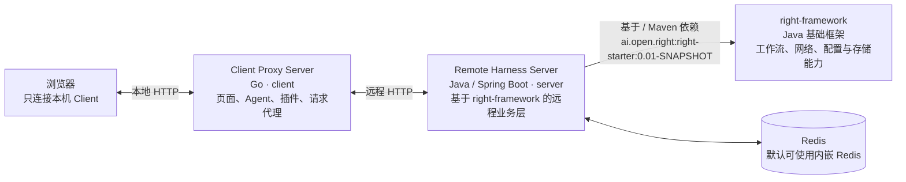
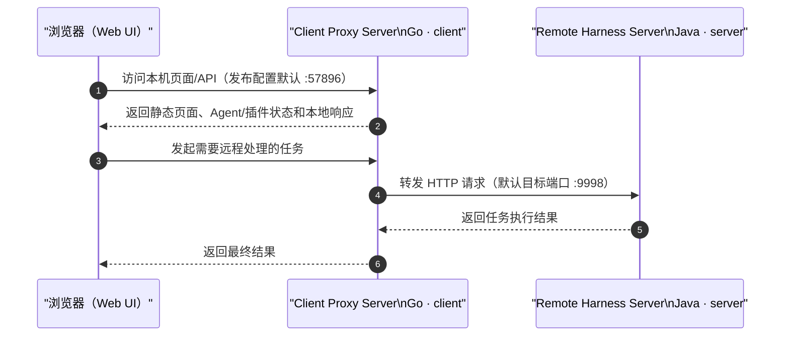
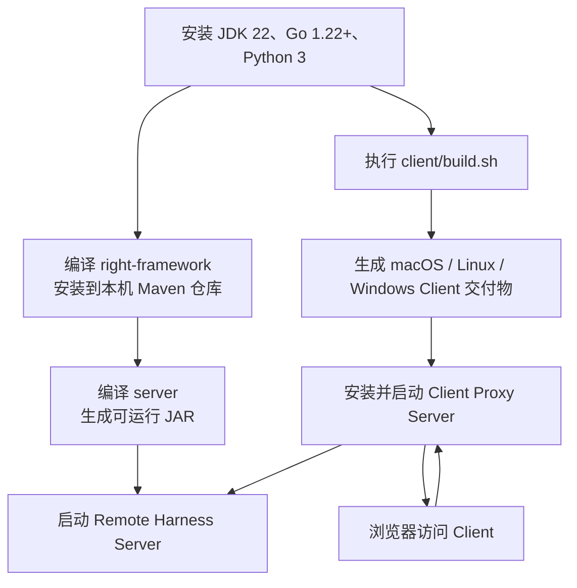
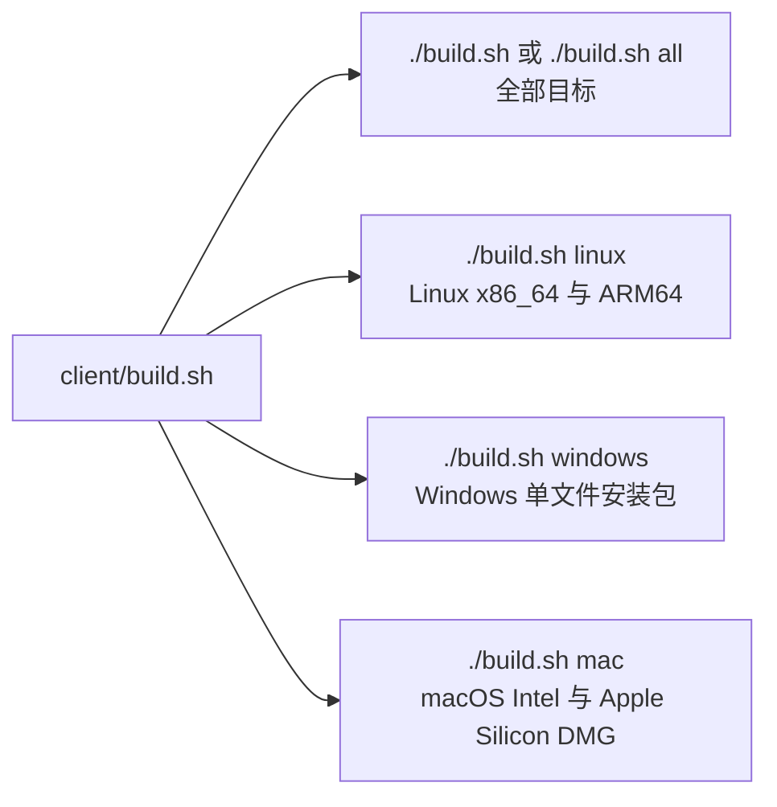

# <a href="https://www.deepright.cn/">DeepRight</a>

> **本手册建议使用AI构建，构件提示词：请克隆github.com/jwsnt/deepright到下载目录，并开始构建**

DeepRight 由浏览器端、客户端代理和远程服务端三部分组成。浏览器只与本机的 Client Proxy Server 通信；Client 负责提供本地 Web 页面、管理 Agent/插件，并将需要远程执行的请求转发至 Remote Harness Server。



Remote Harness Server（`server`）并非独立的底层框架：它**构建在 `right-framework` 之上**。`right-framework` 提供工作流、网络通信、配置、存储等基础能力；`server` 在此基础上实现路由、鉴权、安全、任务和媒体等业务能力扩展。

## Quick Start

以下示例适用于 MacOS / Linux 开发环境；它用最少的命令启动完整链路。首次执行前请先满足后文的 JDK 22、Go 1.22+ 和 Python 3 要求。

```bash
# 终端 1：编译并启动 Remote Harness Server（从项目根目录执行）
cd right-framework && ./mvnw clean install -DskipTests) && (cd server && ./mvnw clean package
java -jar server/target/deepright-1.0.jar

# 终端 2：构建并启动 Linux Client Proxy Server
cd client && ./build.sh
cd client/release/linux/x86
./integration
```

随后在浏览器打开 `http://127.0.0.1:57896`。Client 的发布配置将本地端口设为 `57896`；可通过 `./integration --port <端口>` 覆盖。

Windows 和 MacOS 的安装包构建、签名及交付方式见后文的「构建 Client Proxy Server」；生产部署的服务端配置见「启动 Remote Harness Server」。

## 为什么选择 DeepRight？

| 能力 | DeepRight 的实现方式 |
| --- | --- |
| 本地浏览器体验 | 浏览器仅访问本机的 Go Client Proxy Server；页面、Agent 状态与插件管理均由 Client 提供。 |
| 远程能力隔离 | Client 只将需要远程处理的请求转发至 Remote Harness Server，浏览器无需直接暴露远程服务。 |
| 框架复用 | 业务服务 `server` 建立在 `right-framework` 之上，复用工作流、网络、配置和存储能力。 |
| 跨平台交付 | 同一构建脚本生成 Linux、Windows WSL2 和 macOS 的 Client 交付物。 |

## 系统架构



| 目录 | 技术栈 | 责任 |
| --- | --- | --- |
| `client` | Go | 构建桌面端/本地 Client Proxy Server，提供浏览器访问的页面、API、插件和 Agent 运行时。 |
| `server` | Java 22、Spring Boot | 基于 `right-framework` 实现的 Remote Harness Server：处理 Client 转发的远程业务请求，以及路由、鉴权、安全、任务和媒体等业务能力。 |
| `right-framework` | Java、Maven | `server` 依赖的底层 Java 框架，提供工作流、网络、配置和存储等通用能力；以 `ai.open.right:right-starter:0.01-SNAPSHOT` 的 Maven 坐标被 `server` 引用。必须先安装到本地 Maven 仓库。 |

> 本文所有命令均从项目根目录执行，即包含 `client/`、`server/` 和 `right-framework/` 的目录。

## 构建与启动关系



## 构建与开发

### 环境准备：服务端

服务端需要 **JDK 22**。Maven 不需要单独安装，两个 Java 工程均自带 Maven Wrapper（`mvnw`）。

```bash
java -version
```

输出中应包含 `22`。如果在 Linux/macOS 上首次执行 Wrapper 时没有执行权限，执行：

```bash
chmod +x right-framework/mvnw server/mvnw
```

### 环境准备：客户端

Client 的 Go 模块最高声明版本为 **Go 1.22**，因此请安装 **Go 1.22 或更高版本**。构建脚本还会用 Python 3 校验 `config/config.json`；macOS 产物构建需要 macOS 自带的 `sips`、`iconutil`、`hdiutil` 等工具。

```bash
go version
python3 --version
```

预期 Go 输出为 `go1.22` 或更高版本。建议使用正式发布版，而不是早期预览版。

### 构建细节（基于代码库扫描）

| 范围 | 代码库中的实际行为 | 对构建的影响 |
| --- | --- | --- |
| Java 版本 | `right-framework/pom.xml` 和 `server/pom.xml` 均声明 `java.version=22`。 | 两个 Java 项目都必须使用 JDK 22 编译。 |
| Maven 依赖 | `server` 直接依赖 `ai.open.right:right-starter:0.01-SNAPSHOT`；该坐标由 `right-framework` 的 `install` 写入本地 Maven 仓库。 | 不能跳过 framework 的 `install`；首次构建需要联网下载 Maven Wrapper 和第三方依赖。 |
| 服务端打包 | `server` 的 Spring Boot Maven 插件在 `package` 阶段执行 `repackage`。 | `server/target/deepright-1.0.jar` 是包含依赖、可直接 `java -jar` 的包。 |
| Go 版本 | `integration`、`proxy`、`connect`、`agent` 等主要 Go 模块要求 Go 1.22；少数辅助模块是 Go 1.21。 | 统一使用 Go 1.22+ 即可满足全部模块。 |
| Client 主程序 | `build.sh` 从 `client/integration` 交叉编译 `integration`，并从 `client/connect` 编译插件。 | 交付目录中的 `integration`、`plugins/`、`site/`、`config/` 必须作为整体保留。 |
| 构建校验 | 构建开始会以 Python 3 校验 `config/config.json`；结束前会执行浏览器插件契约测试。 | Python 3 是必需工具；构建不只是 Go 编译，还会运行测试校验。 |
| 发布目录 | `build.sh` 会重置对应的 `release/` 目录并清理中间编译产物。 | 不要将手工文件放在 `client/release/` 内；需要保留的运行数据应放在发布目录以外。 |

平台附加要求如下：

- macOS 构建必须在 macOS 主机进行，因为 DMG 打包会调用 `sips`、`iconutil` 和 `hdiutil`，并会尝试使用 `osascript`、`qlmanage` 生成带样式的 DMG。
- Windows 单文件安装包由 Go 交叉编译生成，但构建机必须具备 `zip`；脚本先准备 Linux/WSL 运行载荷，再把载荷封装进 Windows installer/uninstaller `.exe`。
- `./build.sh all` 包含 macOS 打包步骤，因此应在已具备上述 macOS 工具的机器上执行。只需某一类产物时，优先使用 `linux`、`windows` 或 `mac` 参数，减少宿主机工具要求。

## 编译 Remote Harness Server

`server` 依赖 `right-framework` 中的 `ai.open.right:right-starter:0.01-SNAPSHOT`。因此首次构建、修改 framework，或清空本地 Maven 仓库后，都必须先编译并安装 framework。

### 一条命令完成完整构建

```bash
(cd right-framework && ./mvnw clean install -DskipTests) && (cd server && ./mvnw clean package)
```

该命令按以下顺序运行：

1. 进入 `right-framework`，清理旧构建结果并执行 `install`；生成的 SNAPSHOT 依赖会安装进当前用户的本地 Maven 仓库（通常为 `~/.m2/repository`）。
2. 仅跳过 framework 的测试，避免测试耗时影响首次构建；使用 Maven 标准参数 `-DskipTests`。
3. 仅当 framework 构建成功时，进入 `server` 执行 `clean package`。
4. `server` 的 Spring Boot `repackage` 步骤会生成包含依赖的可执行 JAR；`right-framework` 本身作为被安装到本地 Maven 仓库的底层依赖。

成功后，服务端可执行包为：

```text
server/target/deepright-1.0.jar
```

可用下面命令确认产物存在：

```bash
ls -lh server/target/deepright-1.0.jar
```

### 分步构建（便于排错）

```bash
cd right-framework
./mvnw clean install -DskipTests

cd ../server
./mvnw clean package
```

开发阶段如果仅修改 `server`，且没有修改 `right-framework`，可只执行最后两行中的 server 构建命令。若希望同时跳过 server 测试，可使用：

```bash
cd server && ./mvnw clean package -DskipTests
```

## 启动 Remote Harness Server

构建完成后，从项目根目录运行：

```bash
java -jar server/target/deepright-1.0.jar
```

服务默认使用 `chat.http.port=9998`。它会在启动时按 `server/src/main/resources/right-global.properties` 读取配置；以下环境变量可在启动前覆盖关键配置：

```bash
export CHAT_HTTP_HOST="http://<远程服务可访问的主机名或 IP>"
export CHAT_HTTP_PORT=9998
export FILE_STORE_SYS_PATH="/absolute/path/to/deepright-data"

java -jar server/target/deepright-1.0.jar
```

| 配置项 | 默认值 | 说明 |
| --- | --- | --- |
| `CHAT_HTTP_PORT` | `9998` | Remote Harness Server 对 Client 提供 HTTP 服务的端口。 |
| `CHAT_HTTP_HOST` | `http://replace_host.com` | 服务对外可访问的基础地址；部署时应设置为真实地址。 |
| `EMBEDDED_REDIS_ENABLE` | `true` | 是否使用内嵌 Redis。默认值下无需预先安装独立 Redis。 |
| `REDIS_DATA_HOST` / `REDIS_DATA_PORT` | `localhost` / `6379` | 使用外部 Redis 时的数据 Redis 地址。 |
| `REDIS_EVENT_HOST` / `REDIS_EVENT_PORT` | `localhost` / `6379` | 使用外部 Redis 时的事件 Redis 地址。 |

若要在后台运行并记录日志：

```bash
mkdir -p logs
nohup java -jar server/target/deepright-1.0.jar > logs/deepright-server.log 2>&1 &
tail -f logs/deepright-server.log
```

> 仓库内的 `server/run.sh` 预期 JAR 位于当前目录。直接执行上面的 `java -jar server/target/deepright-1.0.jar` 不依赖额外复制文件，适合开发和部署验证。

## 构建 Client Proxy Server

客户端构建脚本位于 **`client/build.sh`**。脚本会交叉编译 Go 的主程序与插件，复制页面和配置，并按目标平台生成安装/分发包。

先进入脚本目录：

```bash
cd client
chmod +x build.sh
```

### 选择构建目标



| 命令 | 适用场景 | 主要输出位置 |
| --- | --- | --- |
| `./build.sh` 或 `./build.sh all` | 一次构建脚本支持的全部目标 | `release/linux/`、`release/windows/`、`release/mac/` |
| `./build.sh linux` | 构建 Linux x86_64、ARM64 运行目录，并附带 WSL2 启动文件 | `release/linux/x86/`、`release/linux/arm/` |
| `./build.sh windows` | 构建 Windows x86_64、ARM64 的单文件 installer 与 uninstaller；会先构建 Linux/WSL 载荷 | `release/windows/x86/`、`release/windows/arm/` |
| `./build.sh mac` | 在 macOS 上构建 Intel、Apple Silicon 的应用和 DMG | `release/mac/x86/`、`release/mac/arm/` |

例如，在 Apple Silicon Mac 上构建 macOS 分发包且不进行代码签名：

```bash
cd client
DEEPRIGHT_SKIP_SIGN=1 ./build.sh mac
```

脚本默认会根据可用证书自动尝试签名。设置 `DEEPRIGHT_SKIP_SIGN=1` 可在没有 Apple 证书的开发环境中跳过签名；生成的 DMG 仍可用于本地验证。要签名发布包，可设置 `DEEPRIGHT_KEY`、`DEEPRIGHT_IDENTITY` 等脚本支持的签名参数后再构建。

### Client 构建产物

构建结束时，脚本会打印 `Build completed:`，并列出 `release/` 中的最终文件。典型交付物如下：

```text
client/release/
├── linux/
│   ├── x86/                         # Linux x86_64 运行目录
│   │   ├── integration              # Client Proxy Server 可执行文件
│   │   ├── plugins/                 # Go 编译的连接器/插件
│   │   ├── site/                    # 浏览器静态页面
│   │   ├── config/                  # Client 配置
│   │   ├── helpers/                 # CLI Sandbox 等辅助程序
│   │   ├── install.bat / install.ps1# Windows WSL2 安装入口
│   │   └── start.bat                # Windows WSL2 启动入口
│   └── arm/                         # Linux ARM64，对应同样的运行结构
├── windows/
│   ├── x86/DeepRight-windows-x86-installer.exe
│   ├── x86/DeepRight-windows-x86-uninstaller.exe
│   ├── arm/DeepRight-windows-arm-installer.exe
│   └── arm/DeepRight-windows-arm-uninstaller.exe
└── mac/
    ├── x86/DeepRight.app、DeepRight-x86.dmg  # Intel Mac
    └── arm/DeepRight.app、DeepRight-arm.dmg  # Apple Silicon Mac
```

其中：

- `integration` 是 Go 编译出的 Client Proxy Server 主程序；它会优先读取 `config/config.json` 的 `port`，当前发布配置为 `57896`。仅当配置中没有 `port` 时，源码默认回退为 `8080`；命令行 `--port` 可显式覆盖配置。
- `plugins/` 是与主程序一起分发的连接器/插件可执行文件和运行资源。
- `site/` 是本地浏览器 UI 的静态资源。
- `config/` 含 Client 默认配置；其中 `config/config.json` 的 `host` 是 Remote Harness Server 地址，`port` 是 Client 本地 HTTP 监听端口。当前源配置的 `host` 为 `https://www.deepright.cn`、`port` 为 `57896`，部署时应替换为实际地址。
- macOS 用户按 CPU 架构下载对应 DMG：Apple Silicon 选择 `arm`，Intel 选择 `x86`。
- Windows 用户按 CPU 架构运行对应的 `installer.exe`；Linux 用户保留与架构匹配的完整运行目录，不要只复制其中的 `integration` 文件。

## 启动 Client 并连接服务端

在 Linux 的解压/构建目录中，Client 的基础启动方式为：

```bash
cd client/release/linux/x86
./integration
```

随后在浏览器打开：

```text
http://127.0.0.1:57896
```

也可在不修改配置文件的情况下，通过参数指定本地监听端口和上游服务地址：

```bash
./integration --port 57896 --host http://192.0.2.10:9998
```

对于 macOS 和 Windows，请安装相应的 DMG 或 `installer.exe` 交付物后启动 DeepRight。Client 启动后同样由浏览器访问本地页面。

将 Client 指向实际的 Remote Harness Server 前，检查发布包中的配置文件：

```bash
cd client/release/linux/x86
grep '"host"' config/config.json
```

将其中的 `host` 改为 Remote Harness Server 的可访问地址。例如服务端部署在 `192.0.2.10:9998` 时，填写：

```json
{
  "host": "http://192.0.2.10:9998"
}
```

配置变更后重启 Client。网络部署时还需确保 Client 所在机器可以访问服务端的 `CHAT_HTTP_PORT`（默认 `9998`），并在防火墙/安全组中放行该端口。

## 常用检查与排错

| 现象 | 检查方式 | 处理建议 |
| --- | --- | --- |
| `right-starter:0.01-SNAPSHOT` 找不到 | 确认先执行了 `right-framework` 的 `install` | 重新运行一条命令完整构建。 |
| Java 版本不符 | `java -version` | 切换到 JDK 22 后重新构建。 |
| Go 编译失败 | `go version` | 使用 Go 1.22+，并确认 `go` 已在 `PATH` 中。 |
| `python3 is required` | `python3 --version` | 安装 Python 3；脚本需要它校验 JSON 配置。 |
| macOS 打包报缺少签名证书 | 检查构建日志 | 开发构建使用 `DEEPRIGHT_SKIP_SIGN=1 ./build.sh mac`；发布时配置签名证书。 |
| Client 无法连到远程服务 | 检查 `config/config.json` 的 `host`、服务端进程及 9998 端口 | 从 Client 主机执行 `curl http://<server>:9998/` 或按实际 API 进行连通性验证。 |
| 9998 或 57896 被占用 | `lsof -i :9998`、`lsof -i :57896` | 停止占用进程，或用 `./integration --port <端口>` 改用其他本地端口。 |

## 快速命令汇总

```bash
# 1) 编译 Java framework 和 Remote Harness Server
(cd right-framework && ./mvnw clean install -DskipTests) && (cd server && ./mvnw clean package)

# 2) 启动 Remote Harness Server
java -jar server/target/deepright-1.0.jar

# 3) 构建 macOS Client（无签名开发构建示例）
(cd client && DEEPRIGHT_SKIP_SIGN=1 ./build.sh mac)

# 4) 构建全部 Client 平台交付物
(cd client && ./build.sh all)
```

## 现在试用版本
+ 欢迎品尝：https://www.deepright.cn/
